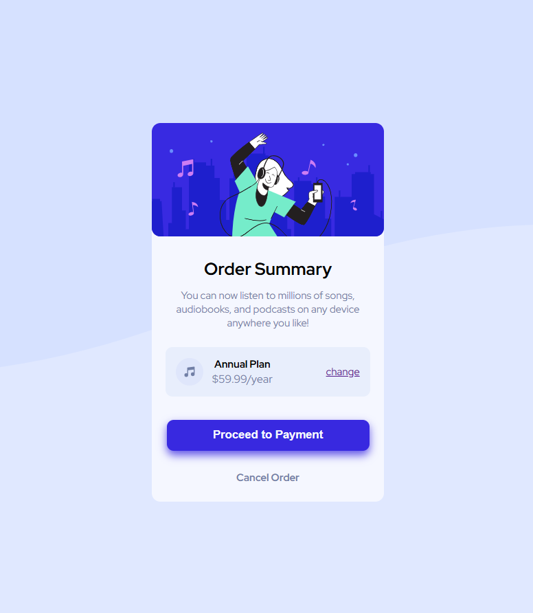

# Frontend Mentor - Order Summary Component

## Overview

This is my solution for the **Order Summary Component** challenge from Frontend Mentor.

I built this project using HTML and CSS and focused on matching the original design while making the card responsive.

## Built With

* HTML5
* CSS3
* Flexbox
* Responsive Design
* HSL Colors
* CSS Gradients

## What I Learned

While building this project, I practiced:

* Creating a centered card layout with Flexbox
* Using background images
* Working with gradients
* Creating responsive layouts
* Using spacing and sizing to match a design
* Styling buttons and hover effects

## Challenges

The main challenge was matching the spacing and sizing of the card while keeping the layout responsive.

I also practiced getting the background image and payment section to look close to the original design.

## Live Demo

https://abas-aqil.github.io/order-summary-component/

## Repository

https://github.com/Abas-Aqil/order-summary-component

## Frontend Mentor

Challenge:

https://www.frontendmentor.io/challenges/order-summary-component-QlPmajDUj

## Author

**Abas Aqil**

* GitHub: https://github.com/Abas-Aqil
* Portfolio: https://abas-aqil.github.io
* Frontend Mentor: https://www.frontendmentor.io/profile/Abas-Aqil

## Acknowledgements

Thanks to Frontend Mentor for providing the challenge design and assets.
